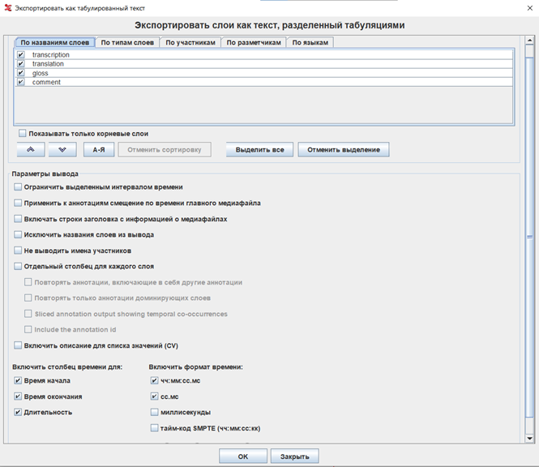

# elan2LaTeX & LaTeX2elan

This tool allows to:
* convert delimited text exported from ELAN into `.tex` files.
* convert properly formatted `.tex` files into `.eaf` files.

## Instruction

### elan2LaTeX
1. Annotate your text using ELAN. Layers are the following:
   * transcription (phonetic form of sentences)
   * gloss (morphemes annotation)
   * translation
   * comment (any additional information)

2. Export as delimited file as shown on the following screenshots (results in example.txt)

3. Clone the repo `git clone https://github.com/le-beda/elan2LaTeX-LaTeX2elan.git`
4. Go inside the repo `cd elan2LaTeX-LaTeX2elan`
5. Run converter `python elan2LaTeX.py`
6. Convert resulting `.tex` file to pdf using [overleaf](https://www.overleaf.com/) (results in example.pdf)

### LaTeX2elan
1. Provide a LaTeX file, formatted like `example.tex`.
2. Provide a `.wav` audio file (optional).
3. Clone the repo `git clone https://github.com/le-beda/elan2LaTeX-LaTeX2elan.git`
4. Go inside the repo `cd elan2LaTeX-LaTeX2elan`
5. Run converter `python LaTeX2elan.py`
6. Import resulting `.eaf` file to ELAN.
